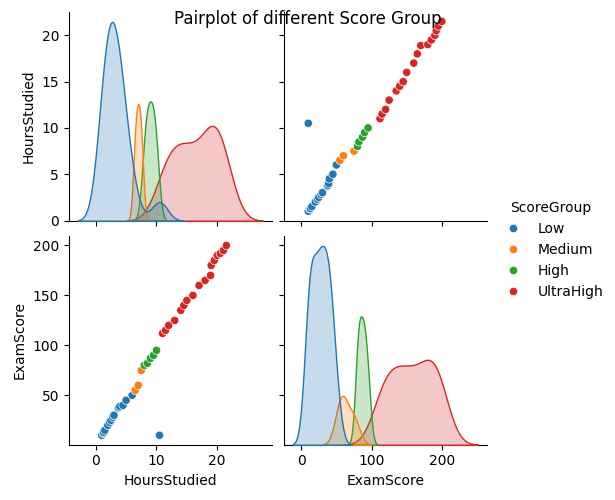
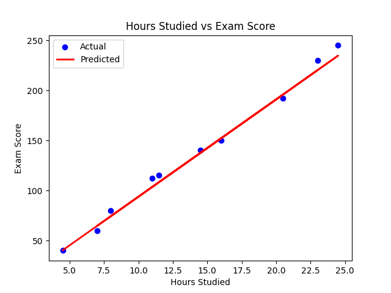

This model will predict the ExamScore of a student based on the time in hours they study.

To train this model we have loaded the data of 50 students about their ExamScore and the time in hours they study from a csv file.
We have used LinearRegression algorithm from scikit  learn's linear model library to train our model.

The r2 score of our prediction is: 0.99
The MSE or Mean Squared error of our prediction is: 39.49

We have also generated a pairplot with partial data by categorizing the data into Low, Medium, High, UltraHigh score, which looks as 

The Regression plot between actual output vs predicted output looks as 